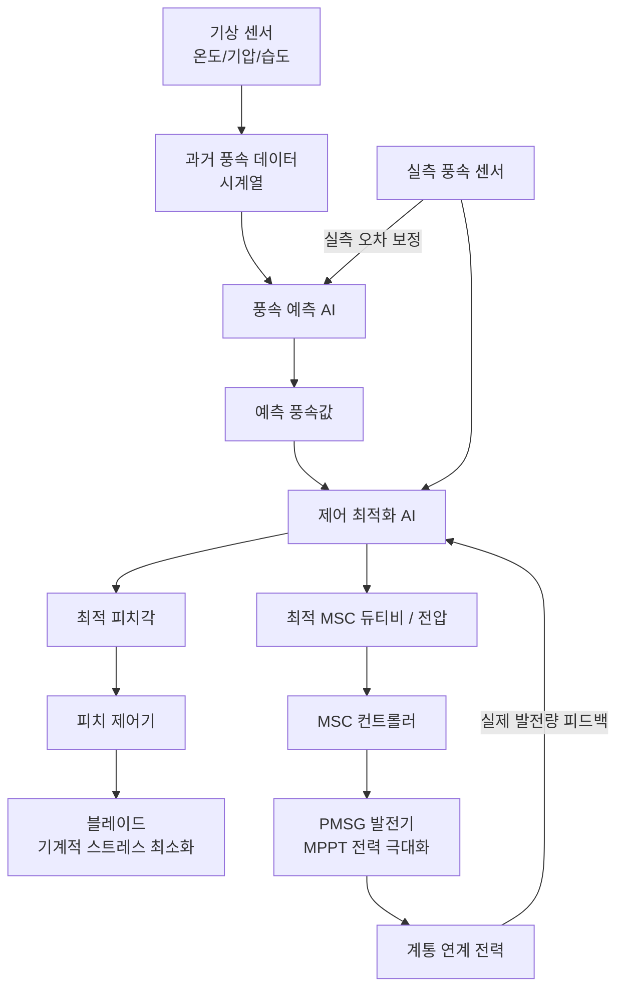

# Capstone-Design
캡스톤디자인

# 풍력 AI 이중 제어 시스템 블럭도

```mermaid
flowchart TD
    A[기상 센서<br/>온도/기압/습도] --> B
    B[과거 풍속 데이터<br/>시계열] --> C
    C[풍속 예측 AI] --> D[예측 풍속값]
    D --> E
    F[실측 풍속 센서] --> E
    E[제어 최적화 AI] --> G[최적 피치각]
    E --> H[최적 MSC 듀티비 / 전압]
    G --> I[피치 제어기]
    I --> J[블레이드<br/>기계적 스트레스 최소화]
    H --> K[MSC 컨트롤러]
    K --> L[PMSG 발전기<br/>MPPT 전력 극대화]
    L --> M[계통 연계 전력]
    M -->|실제 발전량 피드백| E
    F -->|실측 오차 보정| C
```
