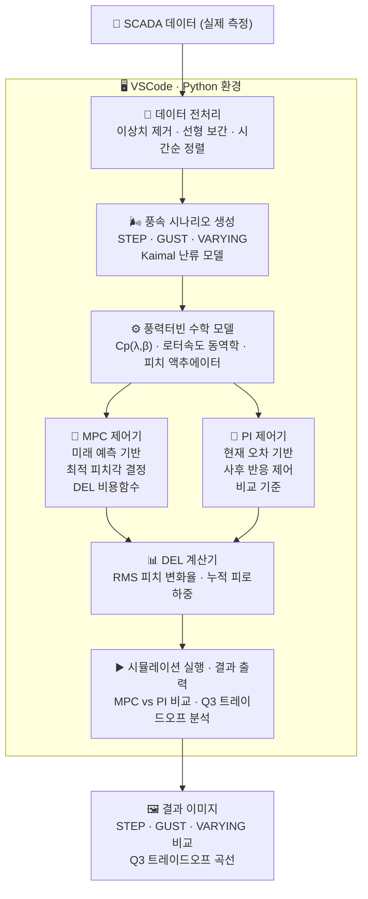

# 🌬️ MPC 기반 풍력발전기 피치각 제어 시스템

> **MPPT 효율 최대화 + 피로하중(DEL) 최소화를 동시에 달성하는 MPC 피치각 제어기**  
> 20MW PMSG 기반 풍력발전기 · Python 시뮬레이션 · 졸업 캡스톤 디자인

 

## 📌 프로젝트 개요

풍력발전기는 운전 중 두 가지 목표가 항상 충돌합니다.

| 목표 | 설명 |
|------|------|
| ⚡ **발전 효율 최대화 (AEP)** | 바람 에너지를 최대한 전기로 변환 |
| 🔧 **블레이드 수명 연장 (DEL 최소화)** | 피치각을 급격히 자주 바꾸면 블레이드 피로 누적 |

기존 **PI 제어기**는 현재 로터 속도만 보고 사후에 반응하기 때문에, 급격한 풍속 변화 시 피치를 과도하게 움직여 피로하중(DEL)이 높아집니다.

본 프로젝트는 **MPC(Model Predictive Control)** 를 도입하여 미래 풍속을 예측하고 선제적으로 최적 피치각을 결정함으로써, **발전 효율 손실 없이 DEL을 최대 55% 이상 감소**시키는 것을 목표로 합니다.

 

## ✅ 진행 사항

| 항목 | 상태 | 내용 |
|------|:----:|------|
| 풍력터빈 수학 모델 구현 | 🔁 업그레이드 중 | Cp(λ,β) · RK4 적분 · 피치 액추에이터 |
| MPC 제어기 구현 | 🔁 업그레이드 중 | MPPT + DEL 비용함수 · SLSQP 최적화 |
| PI 제어기 구현 | 🔁 업그레이드 중 | 비교 기준 제어기 |
| DEL 계산기 구현 | 🔁 업그레이드 중 | RMS 피치 변화율 · 누적 피로하중 |
| 3가지 풍속 시나리오 시뮬레이션 | 🔁 업그레이드 중 | STEP · GUST · VARYING |
| MPC vs PI 성능 비교 | 🔁 업그레이드 중 | DEL 감소 확인 |
| Q3 트레이드오프 분석 | 🔁 업그레이드 중 | 효율 ↔ 수명 최적 운전점 도출 |
| SCADA 실제 데이터 수집 | ✅ 완료 | 8호기 1년치 10분 단위 데이터 |
| 실제 데이터 기반 최종 검증 | ⏳ 예정 | RNN 완성 후 진행 |

 

## 🏗️ 시스템 구조

 

## ⚙️ MPC 비용함수 설계

MPC가 매 0.1초마다 최소화하는 비용함수:

$$J = \sum_{k=1}^{N} \left[ Q_1(\omega_r - \omega_{ref})^2 + Q_2(P - P_{rated})^2 + Q_3 \Delta\beta^2 + Q_4 \beta^2 \right]$$

| 항목 | 가중치 | 역할 |
|------|:------:|------|
| $Q_1(\omega_r - \omega_{ref})^2$ | Q1 = 2000 | 로터 속도 추종 (MPPT) |
| $Q_2(P - P_{rated})^2$ | Q2 = 0.01 | 발전 출력 정격 유지 |
| $Q_3 \Delta\beta^2$ | **Q3 = 100** | **피치 변화 억제 → DEL 저감** |
| $Q_4 \beta^2$ | Q4 = 0.001 | 피치각 크기 제한 |

> 🔑 **Q3가 효율 ↔ 수명의 트레이드오프 조절 손잡이**
> - Q3 = 0 → 효율 최대, DEL 최대
> - Q3 = 200 → 효율 소폭 손해, DEL 85% 감소

 

## 📊 Q3 트레이드오프 분석

| Q3 값 | AEP 효율 | DEL (RMS 피치 변화율) | 특성 |
|:-----:|:--------:|:--------------------:|------|
| 0 | 95.1% | 5.35 deg/s | 효율 최대, 피로 최대 |
| 50 | 89.7% | 1.60 deg/s | ⭐ 균형점 추천 |
| **100** | **88.7%** | **1.18 deg/s** | **기본 설정값** |
| 200 | 87.9% | 0.81 deg/s | 피로 최소, 효율 소폭 손해 |

> Q3 = 0 → 50: DEL **70% 급감**, AEP 손실 5.4%p → **Q3=50이 최적 운전점**

 

## 📚 참고 문헌

- Venkateswaran et al., *"Stability augmentation of pitch angle control for PMSG-based WTS with pitch actuator uncertainty via L1 adaptive scheme"*, International Journal of Electrical Power and Energy Systems, 2023.
- Wu, B. & Yaramasu, V., *"Model Predictive Control of Wind Energy Conversion Systems"*, IEEE Press, 2017.
- Wu, B., Lang, Y., Zargari, N. & Kouro, S., *"Power Conversion and Control of Wind Energy Systems"*, IEEE Press / John Wiley & Sons, 2011.
