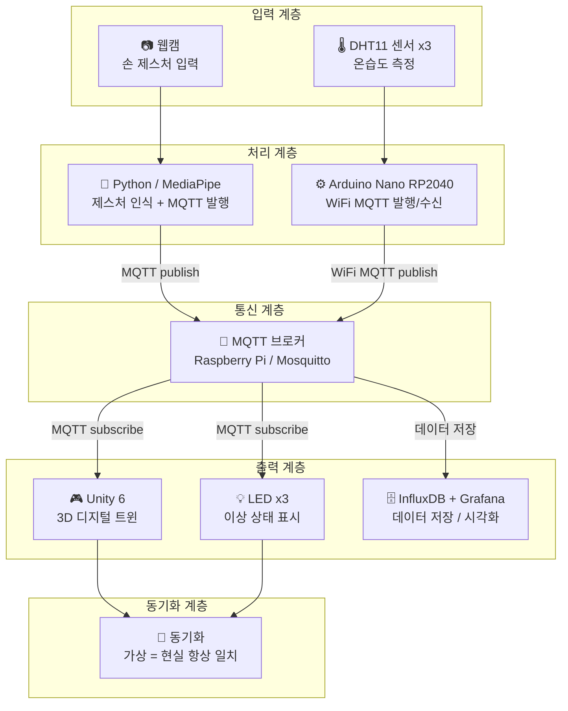

# 🏭 제스처 기반 스마트팩토리 디지털 트윈 시스템

> 손 제스처로 가상 공장 환경을 제어하고, 실제 센서 데이터를 실시간으로 동기화하는 디지털 트윈 시스템


---

## 📌 프로젝트 개요

본 프로젝트는 **MediaPipe 기반 손 제스처 인식**과 **MQTT 통신 프로토콜**을 활용하여 Unity 6 3D 가상 공장과 실제 하드웨어를 실시간으로 동기화하는 **스마트 팩토리 디지털 트윈 시스템**입니다.

- DHT11 온도·습도 센서가 기계 이상을 감지하면 Unity 가상 공장의 해당 기계가 빨간색 경고 상태로 전환됩니다.
- 사용자는 손 제스처만으로 가상 공장 내 기계를 선택하여 실시간 온도·습도·상태를 확인할 수 있습니다.
- Raspberry Pi의 InfluxDB와 Grafana로 센서 데이터를 실시간 저장 및 시각화합니다.

---

## 🧩 시스템 블럭도



---

## 🔄 데이터 흐름

### 시나리오 A — 이상 감지
```
DHT11 온도 임계값 초과
  → RP2040 LED 깜빡임
  → WiFi MQTT publish (factory/machine/1~3/status)
  → Unity 해당 기계 빨간색 점멸
  → InfluxDB 데이터 저장 → Grafana 대시보드 반영
  → 사용자 open_hand 제스처로 기계 선택
  → Unity UI 패널 — 온도 / 습도 / 이상 상태 표시
```

### 시나리오 B — 제스처 제어
```
손 제스처 인식 (open_hand / two_fingers / fist)
  → MediaPipe 명령 변환
  → MQTT publish (factory/control)
  → Unity 가상 기계 상태 업데이트
  → RP2040 하드웨어 동시 반응
```

---

## 📡 MQTT 토픽 구조

| 토픽 | 방향 | 설명 |
|------|------|------|
| `factory/machine/1/status` | RP2040 → All | 기계 1 온습도 + 이상 여부 |
| `factory/machine/2/status` | RP2040 → All | 기계 2 온습도 + 이상 여부 |
| `factory/machine/3/status` | RP2040 → All | 기계 3 온습도 + 이상 여부 |
| `factory/machine/alert` | RP2040 → All | 이상 감지 경보 |
| `factory/control` | Python → All | 제스처 명령 전송 |

---

## 🖐️ 제스처 명령

| 제스처 | 명령어 | 동작 |
|--------|--------|------|
| ✋ 손 펴기 | `open_hand` | 화면을 3구역으로 나눠 손목 X 위치로 머신 선택 |
| ✌️ 두 손가락 | `two_fingers` | 선택된 머신 제어 실행 (주황 번쩍임) |
| ✊ 주먹 | `fist` | 선택 취소 / 초기화 |

---

## 🎮 Unity 기능

| 기능 | 설명 |
|------|------|
| 머신 상태 색상 | 정상 → 파랑, 경고 → 초록, 이상 → 빨강 점멸 |
| 카메라 포커싱 | 머신 선택 시 스무스 카메라 이동 |
| UI 패널 | 화면 우측 상단 — 온도 / 습도 / 상태 실시간 표시 |
| 실시간 동기화 | MQTT 메시지 수신 즉시 상태 반영 |

---

## 🔧 기술 스택

| 분류 | 기술 |
|------|------|
| 제스처 인식 | Python, MediaPipe, OpenCV, paho-mqtt |
| 통신 | MQTT (Mosquitto) |
| 데이터 저장/시각화 | InfluxDB, Grafana |
| 중앙 제어 | Raspberry Pi 4 |
| 하드웨어 | Arduino Nano RP2040 Connect, DHT11 x3, LED x3, 220Ω 저항 x3 |
| 가상 환경 | Unity 6, C# |

---

## 📦 하드웨어 구성

| 장비 | 용도 |
|------|------|
| Raspberry Pi 4 | MQTT 브로커 + InfluxDB + Grafana |
| Arduino Nano RP2040 Connect | 센서 읽기 + LED 제어 + WiFi MQTT |
| DHT11 온습도 센서 x3 | 기계 이상 감지 |
| LED x3 | 이상 상태 시각적 표시 |
| 웹캠 (Cosy FullHD) | 손 제스처 입력 |

---

## 🔌 핀 배선

| 부품 | 연결 |
|------|------|
| DHT11 #1 | (+)→3.3V, (-)→GND, (S)→D2 |
| DHT11 #2 | (+)→3.3V, (-)→GND, (S)→D3 |
| DHT11 #3 | (+)→3.3V, (-)→GND, (S)→D4 |
| LED #1 | D10 → 220Ω → LED+ / LED- → GND |
| LED #2 | D11 → 220Ω → LED+ / LED- → GND |
| LED #3 | D12 → 220Ω → LED+ / LED- → GND |


---

## 🚀 실행 순서

```
1️⃣  Raspberry Pi — Mosquitto 브로커 실행 확인
    sudo systemctl status mosquitto

2️⃣  Arduino Nano RP2040 — 전원 연결 (자동 실행)
    WiFi 연결 후 MQTT 브로커에 자동 접속

3️⃣  Python — 제스처 인식 실행
    python python/gesture_recognition.py

4️⃣  Unity — SmartFactory 씬 실행
    Play 버튼 클릭 → MQTT 연결 → 실시간 동기화 시작

5️⃣  Grafana — 대시보드 확인
    브라우저 → http://[라파 IP]:3000
```

---

## 👨‍💻 개발자

| 이름 | 역할 |
|------|------|
| seyong628 | 전체 시스템 설계 및 개발 |

---

> 임베디드 소프트웨어학과 졸업작품 | 2025
