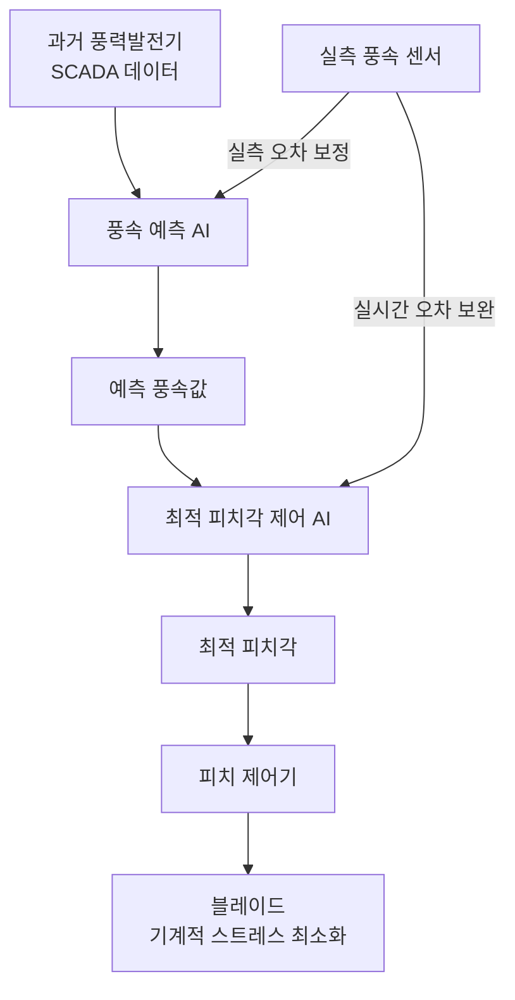

# Capstone-Design
캡스톤디자인

# 풍력 AI 이중 제어 시스템 블럭도

```mermaid
flowchart TD
    A[과거 풍력발전기<br/>SCADA 데이터] --> C
    F[실측 풍속 센서] -->|실측 오차 보정| C
    F -->|실시간 오차 보완|E
    C[풍속 예측 AI] --> D[예측 풍속값]
    D --> E[최적 피치각 제어 AI]
    E --> G[최적 피치각]
    G --> I[피치 제어기]
    I --> J[블레이드<br/>기계적 스트레스 최소화]
```

- SCADA 데이터 : 발전기의 운전 상태, 환경 요인, 성능을 실시간으로 수집, 기록한 자료 (발전기별 일시, 가동/정지 시간, 발전략, 풍속 및 풍향, 기온 및 압력, 피치각, 로터 회전속도)
