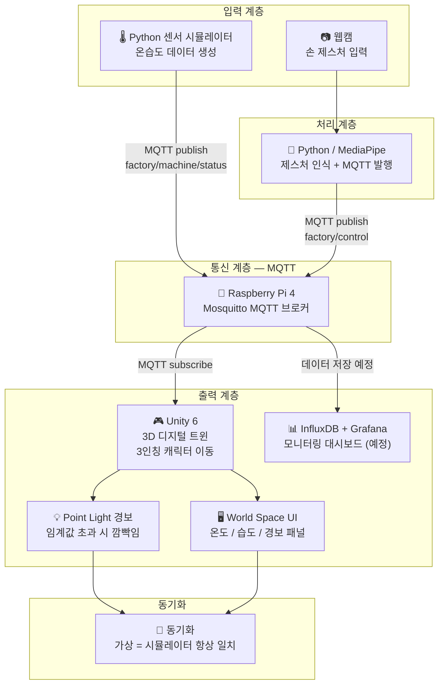

# 🏭 제스처 기반 스마트 팩토리 디지털 트윈

> 손 제스처만으로 3D 가상 공장을 제어하고, 시뮬레이터 센서 데이터를 실시간으로 동기화하는 캡스톤 디자인 프로젝트

  
  
  
  
  
  
  
  

---

## 📌 프로젝트 개요

본 프로젝트는 **MediaPipe 기반 손 제스처 인식**과 **MQTT 통신 프로토콜**을 활용하여 Unity 6 3D 가상 공장과 Python 센서 시뮬레이터를 실시간으로 동기화하는 **스마트 팩토리 디지털 트윈 시스템**입니다.

- 웹캠으로 손 제스처를 인식하여 가상 공장 내 기계를 선택하고 제어합니다.
- Unity 3D 공장 안에서 3인칭 시점으로 직접 이동하며 기계 상태를 확인합니다.
- Python 센서 시뮬레이터가 온습도 데이터를 MQTT로 발행하여 Unity에 실시간 반영합니다.
- 온도·습도 임계값 초과 시 Point Light 깜빡임과 World Space UI 패널로 경보를 발생시킵니다.
- Grafana 모니터링 대시보드 연동을 통해 데이터를 시각화할 예정입니다.

---

## 🧩 시스템 블럭도

---

## 🖐️ 제스처 명령

| 제스처 | 명령 | 동작 |
|--------|------|------|
| ✋ 손 펼치기 | `open_hand` | 근처 머신 선택 + 상태 패널 표시 |
| ✌️ 두 손가락 (V자) | `two_fingers` | 선택된 머신 제어 실행 |
| ✊ 주먹 | `fist` | 선택 취소 / 초기화 |

---

## 🎮 Unity 구현 내용

| 기능 | 설명 |
|------|------|
| 공장 씬 | Factory Training 에셋 기반 URP 공장 환경 |
| 3인칭 이동 | WASD 키보드 이동 |
| 카메라 | 마우스 좌우 회전 + 스크롤 줌 + 장애물 자동 감지 |
| 캐릭터 | 인간형 캐릭터 모델 적용 |
| 머신 상태 시각화 | Point Light 깜빡임 (정상: 파랑 / 경보: 빨강) |
| 머신 선택 | 근접 거리 감지 + open_hand 제스처 |
| UI 패널 | World Space UI — 온도 / 습도 / 상태 실시간 표시 |
| MQTT 수신 | 실시간 메시지 수신 즉시 씬 반영 |

---

## 📡 MQTT 토픽 구조

| 토픽 | 방향 | 설명 |
|------|------|------|
| `factory/machine/1/status` | 시뮬레이터 → All | 기계 1 온습도 + 이상 여부 |
| `factory/machine/2/status` | 시뮬레이터 → All | 기계 2 온습도 + 이상 여부 |
| `factory/machine/3/status` | 시뮬레이터 → All | 기계 3 온습도 + 이상 여부 |
| `factory/machine/alert` | 시뮬레이터 → All | 임계값 초과 경보 |
| `factory/control` | Python → All | 제스처 명령 전송 |

---

## 🔧 기술 스택

| 분류 | 기술 |
|------|------|
| 제스처 인식 | Python, MediaPipe, OpenCV, paho-mqtt |
| 센서 시뮬레이터 | Python, paho-mqtt |
| 통신 | MQTT (Mosquitto) |
| 중앙 제어 | Raspberry Pi 4 |
| 가상 환경 | Unity 6, C#, URP |
| 모니터링 | InfluxDB + Grafana (예정) |

---

## 💻 시스템 구성

| 장치 | 역할 |
|------|------|
| PC | MediaPipe 제스처 인식 + Python 센서 시뮬레이터 + Unity 실행 |
| Raspberry Pi 4 | Mosquitto MQTT 브로커 |
| 웹캠 (Cosy FullHD) | 손 제스처 입력 |

---

## ✅ 진행 현황

| 항목 | 상태 |
|------|------|
| Unity 공장 씬 구성 | ✅ 완료 |
| 3인칭 캐릭터 이동 + 카메라 | ✅ 완료 |
| 인간형 캐릭터 모델 적용 | ✅ 완료 |
| Python 제스처 인식 | ✅ 완료 |
| Python 센서 시뮬레이터 | ✅ 완료 |
| MQTT 실시간 수신 + 머신 시각화 | ✅ 완료 |
| Point Light 경보 시스템 | ✅ 완료 |
| World Space UI 패널 | ✅ 완료 |
| Grafana 모니터링 연동 | 🔄 예정 |

---

## 👨‍💻 개발자

| 이름 | 역할 |
|------|------|
| seyong628 | 전체 시스템 설계 및 개발 |

---

> 임베디드 소프트웨어학과 졸업 캡스톤 디자인 | 2026
