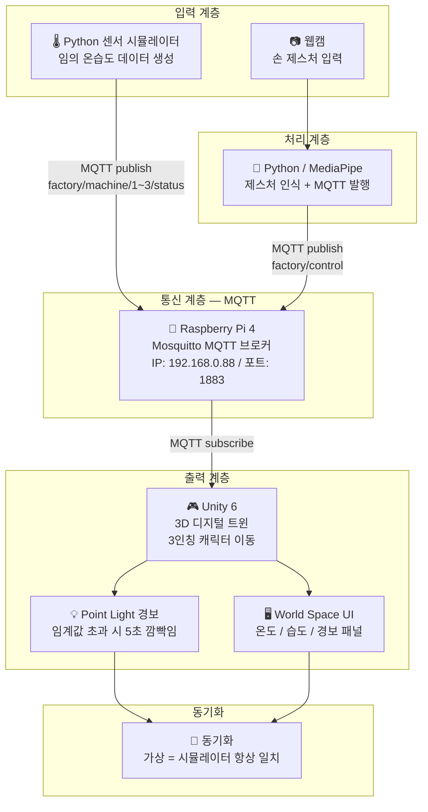

# 🏭 제스처 기반 스마트 팩토리 디지털 트윈

> 손 제스처만으로 3D 가상 공장을 제어하고, 시뮬레이터 센서 데이터를 실시간으로 동기화하는 캡스톤 디자인 프로젝트

<p align="center">
  
  
  
  
  
  
</p>

---

## 📌 프로젝트 개요

본 프로젝트는 **MediaPipe 기반 손 제스처 인식**과 **MQTT 통신 프로토콜**을 활용하여 Unity 6 3D 가상 공장과 Python 센서 시뮬레이터를 실시간으로 동기화하는 **스마트 팩토리 디지털 트윈 시스템**입니다.

- 웹캠으로 손 제스처를 인식하여 가상 공장 내 기계를 선택하고 제어합니다.
- Unity 3D 공장 안에서 3인칭 시점으로 직접 이동하며 기계 상태를 확인합니다.
- Python 센서 시뮬레이터가 임의의 온습도 데이터를 MQTT로 발행하여 Unity에 실시간 반영합니다.
- 온도·습도 임계값 초과 시 Point Light 깜빡임과 World Space UI 패널로 경보를 발생시킵니다.

---

## 🧩 시스템 블럭도



---

## 🖐️ 제스처 명령

| 제스처 | 명령 | 동작 |
|--------|------|------|
| ✋ 손 펼치기 | `open_hand` | 근처 머신 선택 + 상태 패널 표시 |
| ✌️ 두 손가락 (V자) | `two_fingers` | 근처 머신 애니메이션 즉시 정지 |
| ✊ 주먹 | `fist` | 근처 머신 애니메이션 재개 + 선택 취소 |

> `two_fingers` / `fist` 는 `open_hand` 선택 없이도 근접 범위 내 머신에 직접 동작합니다.

---

## 🎮 Unity 구현 내용

| 기능 | 설명 |
|------|------|
| 공장 씬 | Factory Training 에셋 기반 URP 공장 환경 |
| 3인칭 이동 | WASD 키보드 이동 (CharacterController) |
| 카메라 | 마우스 좌우/상하 회전 + 스크롤 줌 + Raycast 장애물 자동 감지 |
| 캐릭터 | 인간형 캐릭터 모델 적용 |
| 머신 상태 시각화 | Point Light 깜빡임 (정상: 파랑 / 선택: 초록 / 경보: 빨강) |
| 머신 경보 | 임계값 초과 시 5초 깜빡임 후 자동 해제 |
| 머신 구동 애니메이션 | Mathf.PingPong 왕복 운동으로 기계 가동 표현 |
| 머신 선택 | 근접 거리 감지 + `open_hand` 제스처 |
| 머신 제어 | `two_fingers` → 정지 / `fist` → 재개 |
| UI 패널 | World Space UI — 온도 / 습도 / 경보 상태 + 빌보드 효과 |
| MQTT 수신 | 실시간 메시지 수신 즉시 씬 반영 (메인 스레드 큐 방식) |

---

## 📡 MQTT 토픽 구조

| 토픽 | 방향 | 페이로드 예시 |
|------|------|--------------|
| `factory/machine/1/status` | 시뮬레이터 → All | `{"machine_id":1,"temp":25.3,"humid":60.1,"alert":false,"status":"normal"}` |
| `factory/machine/2/status` | 시뮬레이터 → All | `{"machine_id":2,"temp":35.1,"humid":85.0,"alert":true,"status":"anomaly"}` |
| `factory/machine/3/status` | 시뮬레이터 → All | `{"machine_id":3,"temp":24.8,"humid":58.2,"alert":false,"status":"normal"}` |
| `factory/machine/alert` | 시뮬레이터 → All | `{"machine_id":2,"temp":35.1,"humid":85.0,"alert":true,"status":"anomaly"}` |
| `factory/control` | Python → All | `{"gesture":"open_hand","machine_id":0}` |

> MQTT 브로커: Raspberry Pi 4 / IP `192.168.0.88` / 포트 `1883` (WebSocket `9001`)

---

## 🔧 기술 스택

| 분류 | 기술 |
|------|------|
| 제스처 인식 | Python, MediaPipe HandLandmarker Tasks API, OpenCV, paho-mqtt |
| 센서 시뮬레이터 | Python, paho-mqtt |
| 통신 | MQTT (Mosquitto), M2MqttUnity |
| 중앙 제어 | Raspberry Pi 4 |
| 가상 환경 | Unity 6, C#, URP |

---

## 💻 시스템 구성

| 장치 | 역할 |
|------|------|
| PC | MediaPipe 제스처 인식 + Python 센서 시뮬레이터 + Unity 실행 |
| Raspberry Pi 4 | Mosquitto MQTT 브로커 |
| 웹캠 (Cosy FullHD) | 손 제스처 입력 |

---

## 📁 프로젝트 구조

```
Capstone-Design/
├── python/
│   ├── gesture_recognition.py    # MediaPipe 제스처 인식 + MQTT 발행
│   ├── mqtt_publisher.py         # MQTT 헬퍼 클래스
│   └── sensor_simulator.py       # 임의 온습도 데이터 생성 + MQTT 발행
├── unity/
│   └── SmartFactory/             # Unity 6 URP 프로젝트
│       └── Assets/Scripts/
│           ├── MqttManager.cs         # MQTT 수신/라우팅 (싱글톤)
│           ├── MachineController.cs   # 머신 상태 시각화 + 경보
│           ├── MachineAnimator.cs     # 머신 구동 애니메이션
│           ├── GestureReceiver.cs     # 제스처 명령 처리
│           ├── UIManager.cs           # World Space UI 패널
│           ├── PlayerController.cs    # WASD 3인칭 이동
│           └── TPSCameraController.cs # 마우스 카메라 (직접 구현)
└── README.md
```

---

## 🚀 실행 순서

```
1️⃣  Raspberry Pi — Mosquitto 브로커 실행 확인
    sudo systemctl status mosquitto

2️⃣  Python — 센서 시뮬레이터 실행
    python python/sensor_simulator.py

3️⃣  Python — 제스처 인식 실행
    python python/gesture_recognition.py

4️⃣  Unity — SmartFactory 씬 실행
    Play 버튼 → MQTT 연결 → 실시간 동기화 시작
```

---

## ⚙️ 설치 방법

### Raspberry Pi 4
```bash
sudo apt install mosquitto mosquitto-clients -y
sudo systemctl enable mosquitto
sudo systemctl start mosquitto
echo "listener 1883" | sudo tee -a /etc/mosquitto/mosquitto.conf
echo "allow_anonymous true" | sudo tee -a /etc/mosquitto/mosquitto.conf
sudo systemctl restart mosquitto
```

### Python
```bash
python -m venv venv
venv\Scripts\activate        # Windows
# source venv/bin/activate   # Mac/Linux
pip install mediapipe opencv-python paho-mqtt
```

### Unity
```
Unity Hub → 프로젝트 열기 → unity/SmartFactory
smartfactory_main 씬 실행
```

---

## ✅ 진행 현황

| 항목 | 상태 |
|------|------|
| Factory Training 에셋 기반 공장 씬 | ✅ 완료 |
| 3인칭 캐릭터 이동 (WASD) | ✅ 완료 |
| 마우스 카메라 (회전 / 줌 / 장애물 감지) | ✅ 완료 |
| 인간형 캐릭터 모델 적용 | ✅ 완료 |
| MQTT 연결 및 메시지 라우팅 | ✅ 완료 |
| 머신 상태 시각화 (URP 색상 + Point Light) | ✅ 완료 |
| 임계값 기반 5초 경보 후 자동 해제 | ✅ 완료 |
| 머신 구동 애니메이션 (PingPong 왕복) | ✅ 완료 |
| 제스처 기반 머신 선택 / 정지 / 재개 | ✅ 완료 |
| World Space UI 패널 (빌보드 효과) | ✅ 완료 |
| MediaPipe 제스처 인식 + 스무딩 | ✅ 완료 |
| Python 센서 시뮬레이터 | ✅ 완료 |
| Raspberry Pi 연동 테스트 | ✅ 완료 |

---

## 🐛 해결한 주요 문제

| 문제 | 해결 방법 |
|------|----------|
| Cinemachine 3.x 카메라 충돌 | TPSCameraController 직접 구현으로 교체 |
| WASD 입력 시 카메라 회전 | CinemachineOrbitalFollow 제거로 완전 해결 |
| 플레이어 바닥 뚫고 떨어짐 | Capsule Collider + CharacterController 중복 제거 |
| 머신 색상 변경 안 됨 (URP) | `_Color` 제거, `_BaseColor`만 사용 |
| 머신 자식 경로 못 찾음 | 실제 Hierarchy 확인 후 경로 수정 |
| two_fingers가 선택 후에만 동작 | GetNearestMachine() 헬퍼로 분리 |

---

## 🎬 시연 영상

<!-- YouTube 업로드 후 아래 YOUR_VIDEO_ID 부분을 실제 영상 ID로 교체하세요 -->
<!-- 예시: https://youtu.be/abc123xyz 이면 YOUR_VIDEO_ID = abc123xyz -->

[](https://youtu.be/5WLTH0Wkksw)

---

## 👨‍💻 개발자

| 이름 | 역할 |
|------|------|
| seyong628 | 전체 시스템 설계 및 개발 |

---

> 임베디드 소프트웨어학과 졸업 캡스톤 디자인 | 2026
