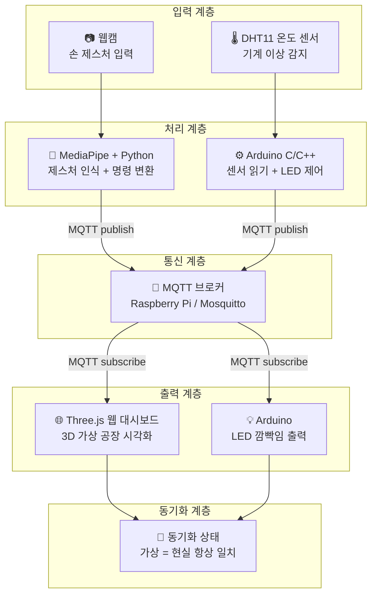

# 🏭 Gesture-Based Smart Factory Digital Twin System

> 손 제스처로 가상 공장 환경을 제어하고, 실제 센서 데이터를 실시간으로 동기화하는 디지털 트윈 시스템

---

## 📌 프로젝트 개요

본 프로젝트는 **MediaPipe 기반 손 제스처 인식**과 **MQTT 통신 프로토콜**을 활용하여 Three.js 3D 가상 공장과 실제 Arduino 하드웨어를 실시간으로 동기화하는 **스마트 팩토리 디지털 트윈 시스템**입니다.

- 온도 센서가 기계 이상을 감지하면 LED가 깜빡이고, 브라우저의 3D 가상 공장에서 해당 기계가 경고 상태로 표시됩니다.
- 사용자는 손 제스처로 가상 공장 내 기계를 선택하여 현재 상태(온도, 이상 여부 등)를 확인할 수 있습니다.

---

## 🧩 시스템 아키텍처



---

## 🔄 데이터 흐름

### 시나리오 A — 이상 감지
```
DHT11 온도 상승
  → Arduino LED 깜빡임
  → MQTT publish (factory/machine/status)
  → Three.js 가상 기계 빨간색으로 변환
  → 사용자 제스처로 기계 선택
  → 상태 팝업 표시 (온도: 78°C / 상태: 이상)
```

### 시나리오 B — 정상 제어
```
손 제스처 (Open Hand)
  → MediaPipe 명령 변환
  → MQTT publish (factory/control)
  → Three.js 가상 기계 업데이트 (동시)
  → Arduino 하드웨어 반응 (동시)
```

---

## 📡 MQTT 토픽 구조

| 토픽 | 방향 | 설명 |
|------|------|------|
| `factory/machine/status` | Arduino → All | 센서 데이터 및 기계 상태 전송 |
| `factory/machine/alert` | Arduino → All | 이상 감지 경보 전송 |
| `factory/control` | Python → All | 제스처 명령 전송 |


---

## 🔧 기술 스택

| 분류 | 기술 |
|------|------|
| 제스처 인식 | Python, MediaPipe, OpenCV |
| 통신 | MQTT (paho-mqtt), Mosquitto |
| 중앙 제어 | Raspberry Pi |
| 하드웨어 | Arduino (C/C++), DHT11, LED |
| 가상 환경 | Three.js (JavaScript), WebSocket |

---

## 📦 하드웨어 구성

| 장비 | 용도 |
|------|------|
| Raspberry Pi | MQTT 브로커 (Mosquitto) |
| Arduino | 센서 읽기 + LED 제어 |
| DHT11 온도 센서 | 기계 이상 감지 |
| LED | 이상 상태 시각적 표시 |
| 웹캠 | 손 제스처 입력 |

---
